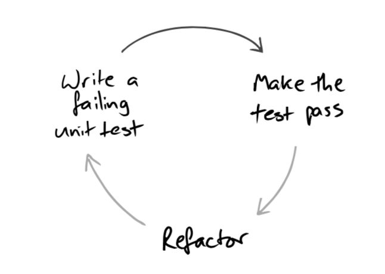
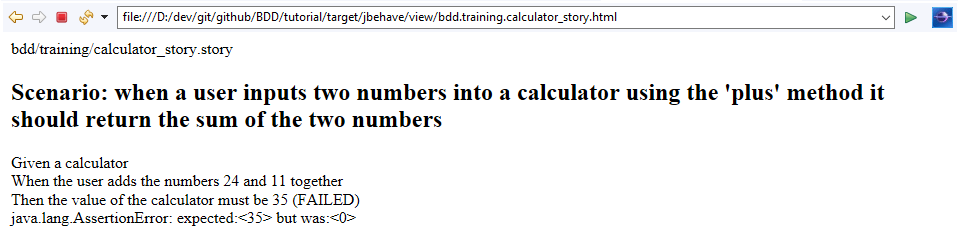
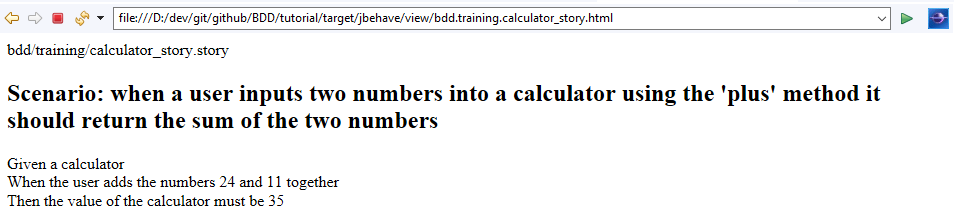

# BDD
## Behaviour Driven Development Tutorial

### Implementing the Calculator
One thing that Test Driven Development methodologies teach us is to iterate and do the bare minimum to pass the test. This means we're not going to rush off and implement an all singing and dancing calculator, we're simply going to get it to do what is needed in this particular scenario.



Combined with Agile development practices, this enables us to get working software in front of our users quickly and frequently, which in turn gives them the opportunity to realise value for the investment earlier and also, where needed, make course corrections. 

Whilst we already have a failing test, that is really because we haven't implemented it, rather than us having a valid test. So first, let's add a genuinely failing implementation to our test class. To do this we will firstly need to create a Calculator class that we can reference.

Add a new class called Calculator in src/main/java/bdd/training with a skeleton of an add function, given that is the feature we need.

```java
package bdd.tutorial;

public class Calculator {
	public int add(int num1, int num2) {
		// TODO: Implement Logic
		return 0;
	}
}
```
Now let's update our test steps to use it in a genuinely failing test.

```java
public class CalculatorSteps {

	private Calculator calculator;
	private int calcResult = 0;

	@Given("a calculator")
	public void setup() {
		calculator = new Calculator();
	}

	@When("the user adds the numbers $number1 and $number2 together")
	public void calculatorAdd(int x, int y) {
		calcResult = calculator.add(x, y);
	}

	@Then("the value of the calculator must be $number")
	public void verifyResult(int result) {
		assertEquals(result, calcResult);
	}
}
```

Note above, as well as implementing an actual verification, we have removed @Pending from our verifyResult method so the test is actually run.

If we run the test now we will see the following in the Console, as well as JUnit telling us the test failed.

```
Processing system properties {}
Using controls EmbedderControls[batch=false,skip=false,generateViewAfterStories=true,ignoreFailureInStories=false,ignoreFailureInView=false,verboseFailures=false,verboseFiltering=false,storyTimeouts=300,threads=1,failOnStoryTimeout=false]

(BeforeStories)

Running story bdd/training/calculator_story.story

(bdd/training/calculator_story.story)
Scenario: when a user inputs two numbers into a calculator using the 'plus' method it should return the sum of the two numbers
Given a calculator
When the user adds the numbers 24 and 11 together
Then the value of the calculator must be 35 (FAILED)
(java.lang.AssertionError: expected:<35> but was:<0>)


(AfterStories)

Generating reports view to 'D:\dev\git\github\BDD\tutorial\target\jbehave' using formats '[stats, console]' and view properties '{navigator=ftl/jbehave-navigator.ftl, views=ftl/jbehave-views.ftl, reports=ftl/jbehave-reports.ftl, nonDecorated=ftl/jbehave-report-non-decorated.ftl, decorated=ftl/jbehave-report-decorated.ftl, maps=ftl/jbehave-maps.ftl}'
Reports view generated with 2 stories (of which 0 pending) containing 1 scenarios (of which 0 pending)
```

Whilst there is a lot of information there, the key lines are:
> When the user adds the numbers 24 and 11 together
> 
> Then the value of the calculator must be 35 (FAILED)
> 
> (java.lang.AssertionError: expected:<35> but was:<0>)

Admittedly, this can be a bit hard to decipher in the Console. Fortunately JBehave supports other formats as well. Go to the CalculatorStory class and update the configuration to include Format.HTML as one of the default formats:

```java
	public Configuration configuration() {
		return new MostUsefulConfiguration().usePendingStepStrategy(new FailingUponPendingStep())
				.useStoryLoader(new LoadFromClasspath(this.getClass())).useStoryReporterBuilder(
						new StoryReporterBuilder().withDefaultFormats().withFormats(Format.CONSOLE, Format.HTML));
	}
```

If we re-run the test and then go to target>jbehave>view>bdd.training.calculator_story.html you will see a HTML version of the ouput that is a little easier to read.



So, now we have a failing test, let's go and implement it. 

```java
	public int add(int num1, int num2) {
		return num1 + num2;
	}
```

Unsurprisingly, when we now run our test we get a passing JUnit and the following output.



And more usefully, when running with coverage we see a fully tested piece of software.


### Next Steps
What we've done is a great step forward. We have a working class and can see that all paths through the code are tested. If we were to procude an XML output version and hook it up to our Continuous Integration builds and tools like Sonar, we would also be able to fail our builds based on test coverage and have nice dashboards produced for us.

However, there are some drawbacks with JBehave. For one, the reports output aren't that nice to view, which also impacts on how intuitive it is to understand if something is working or not. We're also restricted to the Given, When, Then format, which whilst useful for developers can feel very unintuitive for a real end user.

In Section 4 we will introduce an alternative framework called Concordion which gives us a bit more flexibility and some prettier reports. 