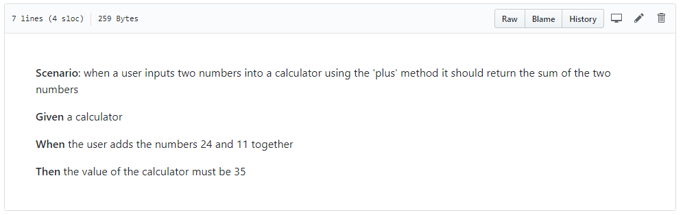
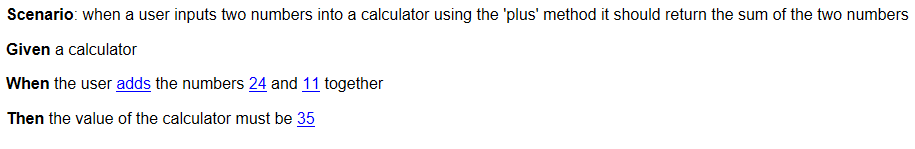
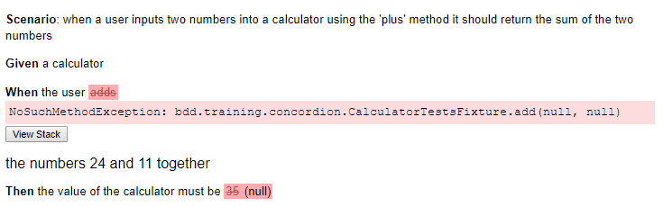
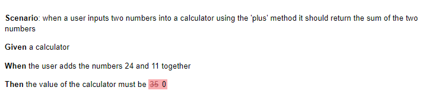
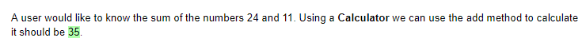
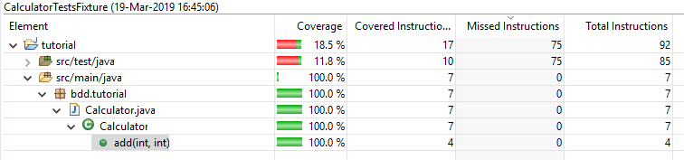

# BDD
## Behaviour Driven Development Tutorial

### Introducing Concordion
[Concordion](http://www.concordion.org) is a framework, primarily for Java and C#, which attempts to bridge the gap between the purist Given, When, Then syntax which ensures clarity and ease of testing, with more freedom to express complex ideas and more readable documentation.

Using the example from the Concordion homepage, you can see that the output is far more visually attractive and along with it intuitive, showing inline and with colour what our expected outcome and actual result of running our code was.


#### Adding Concordion

To use Concordion in our project, we will need to add the dependencies to our build. Open the pom.xml and add the following dependencies.

```xml
<dependency>
	<groupId>org.concordion</groupId>
	<artifactId>concordion</artifactId>
	<version>2.2.0</version>
	<scope>test</scope>
</dependency>
<dependency>
	<groupId>org.chiknrice</groupId>
	<artifactId>concordion-spring-runner</artifactId>
	<version>1.0.0</version>
</dependency>
```

Now, create a new directory in our test package called bdd.training.concordion and create a new text file called CalculatorTests.md. This is a markdown file, which is basically a text file, but when opened with the right tool will provide a rendered version, like a simplified HTML. In fact this page you're reading now is written in markdown. 

Let's add the following to the new file.

```
**Scenario**: when a user inputs two numbers into a calculator using the 'plus' method it should return the sum of the two numbers

**Given** a calculator

**When** the user adds the numbers 24 and 11 together
 
**Then** the value of the calculator must be 35
```

There isn't much difference between the text above and the one we had for the JBehave story file, but when you open it you will see it renders like so.


You can look at the file directly in Github [here](https://github.com/MrCodeghost/BDD/edit/section4/tutorial/src/test/java/bdd/training/concordion/CalculatorTests.md) as well. All we've done is add some bold highlighting, but it already starts to make a difference.

#### Instrumenting
Unlike JBehave, Concordion requires us to put some special markers in our story file to tell it where we want to interact with it. This is called [Instrumenting](https://concordion.org/instrumenting/java/markdown/). In the case of our Calculator class we want to be able to pull in the input numbers, call our add method and validate the result, so our intrumented version would look as follows.

```
**Scenario**: when a user inputs two numbers into a calculator using the 'plus' method it should return the sum of the two numbers

**Given** a calculator 

**When** the user [adds](- "#result = add(#num1, #num2)") the numbers [24](- "#num1") and [11](- "#num2") together

**Then** the value of the calculator must be [35](- "?=#result")
```

 What Concordion is doing here, is effectively overriding the markdown "link" feature to allow us to put hooks into our test where we want to be able to interact with it from our code. Indeed if you view the formatted file it will now look like the below.
 
 

 As you can see, the parts we've instrumented now show up as hyperlinks.
 
 #### Wiring it up
 Now we want to create our test code. Create a new file called CalculatorTestsFixture like below.
 
 ```java
 package bdd.training.concordion;

import org.concordion.integration.junit4.ConcordionRunner;
import org.junit.runner.RunWith;

@RunWith(ConcordionRunner.class)
public class CalculatorTestFixture {

}
 ```
 
 Here, we're using JUnit (the @RunWith annotation) and telling it we want it to delegate responsibility for how tests are run to the ConcordionRunner. JUnit allows various test frameworks to take advantage of it like this. Now we're in a position to run our test. You will get a failed test case from JUnit and in the Console see the following.
 
```
 
file://C:\Users\matth\AppData\Local\Temp\concordion\bdd\training\concordion\CalculatorTests.html
Successes: 0, Failures: 0, Exceptions: 4
 
```
 

If you open the specified file, you will see the following.




As you can see, Concordion is already trying to run our test and failing to tie the instrumentations back to our test class. It has been able to know which story file it should look at just using naming conventions and is telling us clearly that it can't find the test method we've told it exists and that the result is null rather than 35.

#### Coding the test
So, now we have a test hooked up, let's try and make it pass using our existing Calculator class. First let's try and at least make everything find what it is looking for so we don't get stack traces.

```java
@RunWith(ConcordionRunner.class)
public class CalculatorTestsFixture {
	public int add(int num1, int num2) {
		return 0;
	}
}
```

Now when we run our test, there are no more exceptions, but it is still telling us that the result is wrong, as expected given we haven't actually used the Calculator. 



If we update our add method to actually calculate the result like so.

```java
	public int add(int num1, int num2) {
		return new Calculator().add(num1, num2);
	}
```

We would expect it to pass, but instead it is still telling us the value is wrong.


The problem here actually comes down to the order in which Concordion expects us to do things. Because we are calling the method, before we define the values of the parameters, they have been set to the default values of int which is 0. Given we're using Concordion, we don't need to stick to the Given, When, Then format so let's rewrite it in a more natural style and make sure we specify things in the right order.

```
A user would like to know the sum of the numbers [24](- "#num1") and [11](- "#num2"). Using a **Calculator** we can use the [add method](- "#result = add(#num1, #num2)") to calculate it should be [35](- "?=#result").
```

Now when we run our test we get a passing JUnit and the following output.



And we can see we still have 100% test coverage of our Calculator.



### Next Steps
Admittedly the example we've walked through is pretty simple, but hopefully you can now see how Test Driven Development helps make sure we deliver the right thing and also how applying Behaviour Driven Development can improve the contextual understanding of the developer and the communication with the end user.

This tutorial has delibarately used the basic conventions of the tools we've looked at, so please do read further on the websites to get a deeper understanding of how you can make greater use of the tools. For example, Concordion doesn't have to use markdown to write the test stories, you can use HTML instead which gives you complete control over the presentation.

Additionally Eclipse (and IntelliJ) both offer tools to make working with JBehave and Concordion easier. We have deliberately stuck to what you get out of the box with Eclipse in this tutorial, but explore the plugins you can get to provide a better developer experience.

If you have had trouble getting anything in this section to work, change to the section4-final branch to see a working copy of the code.