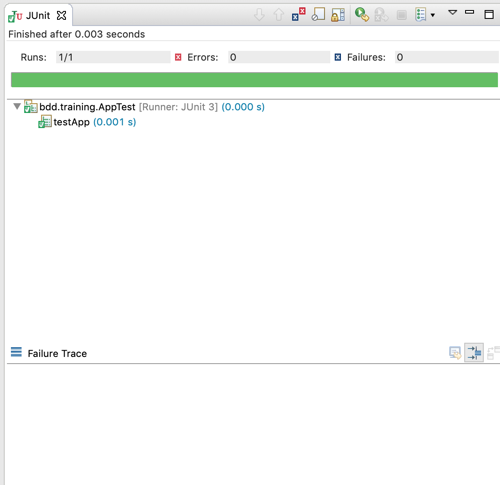
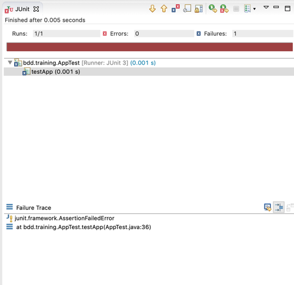

# BDD
## Behaviour Driven Development Tutorial

### What have we got?
Now that we have setup our initial project, let's take a look at what we have.

** App.java **

```java
package bdd.training;

/**
 * Hello world!
 *
 */
public class App 
{
    public static void main( String[] args )
    {
        System.out.println( "Hello World!" );
    }
}
```

You can see in the main App.java class we have a simple main method printing "Hello World!".

```java
package bdd.training;

import junit.framework.Test;
import junit.framework.TestCase;
import junit.framework.TestSuite;

/**
 * Unit test for simple App.
 */
public class AppTest 
    extends TestCase
{
    /**
     * Create the test case
     *
     * @param testName name of the test case
     */
    public AppTest( String testName )
    {
        super( testName );
    }

    /**
     * @return the suite of tests being tested
     */
    public static Test suite()
    {
        return new TestSuite( AppTest.class );
    }

    /**
     * Rigourous Test :-)
     */
    public void testApp()
    {
        assertTrue( true );
    }
}

```

In AppTest we have got a simple JUnit test class. This is possible, because Maven has automatically included the junit library as a dependency in the pom.xml.

```xml
<project xmlns="http://maven.apache.org/POM/4.0.0"
	xmlns:xsi="http://www.w3.org/2001/XMLSchema-instance"
	xsi:schemaLocation="http://maven.apache.org/POM/4.0.0 http://maven.apache.org/maven-v4_0_0.xsd">
	<modelVersion>4.0.0</modelVersion>
	<groupId>bdd.training</groupId>
	<artifactId>tutorial</artifactId>
	<packaging>jar</packaging>
	<version>1.0-SNAPSHOT</version>
	<name>tutorial</name>
	<url>http://maven.apache.org</url>
	<dependencies>
		<dependency>
			<groupId>junit</groupId>
			<artifactId>junit</artifactId>
			<version>3.8.1</version>
			<scope>test</scope>
		</dependency>
	</dependencies>
</project>
```

### Running the AppTest
We can run the test by right clicking on the open AppTest file and choosing "Run As > JUnit Test", which will result in the below appearing in your JUnit View in Eclipse:



This shows us that the test succeeded. If we change the default test to the following:

```java
    /**
     * Rigourous Test :-)
     */
    public void testApp()
    {
        assertTrue( false );
    }
```

And re-run the test you will now see a failure, as we asserted that we expected the statement under test to be true, but returned the value false:



It also gives us some information about what failed in the Failure Trace section.