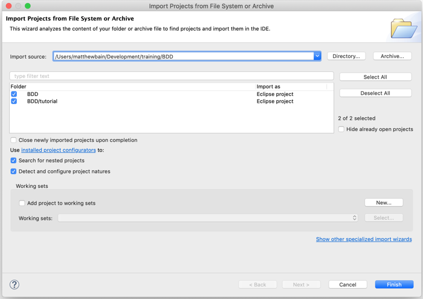
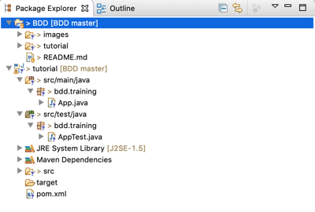

# BDD
## Behaviour Driven Development Tutorial

This project will walk you through how to adopt firstly Test Driven Development and then Behaviour Driven Development in your projects.

Each section walks through steps in the README.md to learn new concepts of TDD or BDD with instructions. However, each section subsequently provides a complete working version from the prior section to continue from if you get into difficulties, by checking out the branch related to the next section.

### Prerequisites
We will be using Java, Maven and Eclipse to go through the rest of this Tutorial. If you don't already have them or equivalent tools setup, please follow the links below before we get started.

* Java    - https://www.java.com/en/download/ 
* Eclipse - https://www.eclipse.org/ 
* Maven   - https://maven.apache.org/download.cgi
* Git     - https://git-scm.com/book/en/v2/Getting-Started-Installing-Git

### Getting Started
To get started clone this repository to your local drive from the command prompt:

```
git clone https://github.com/MrCodeghost/BDD.git
```

To start working we will need a Java project. We will use Maven to create a bare project for us that we can then extend as we move forwards. Change Directory into the BDD directory we just cloned and run the following:

```
	mvn -B archetype:generate -DarchetypeGroupId=org.apache.maven.archetypes -DgroupId=bdd.training -DartifactId=tutorial
```

Now open eclipse and import the project from "File > Open Project from File System" and navigate to the BDD directory we just created.



Import both projects you find and then when expanded, nn the package explorer you should see something similar to below:

